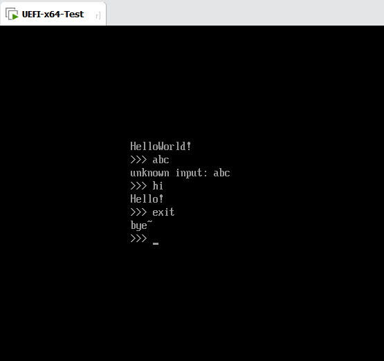

# CSharpEFI

## Build  

```C#
[RuntimeExport(nameof(EfiMain))]
public static long EfiMain(IntPtr imageHandle, EFI_SYSTEM_TABLE* systemTable)
{
    RuntimeInitializer.Initialize(imageHandle, systemTable);

    Span<char> buffer = stackalloc char[1024];
    Console.WriteLine("HelloWorld!");

    while (true)
    {
        buffer.Clear();

        Console.Write(">>> ");
        Console.ReadLine(buffer, 1024, true);
            
        if (string.Equals(buffer, "hi"))
            Console.WriteLine("Hello!");
        else if (string.Equals(buffer, "exit"))
            Console.WriteLine("bye~");
        else
        {
            Console.Write("unknown input: ");
            Console.WriteLine(buffer);
        }
    }
}
```

Ctrl+B 会在输出目录下生成 BOOTX64.EFI, 然后将其放入EFI/BOOT

